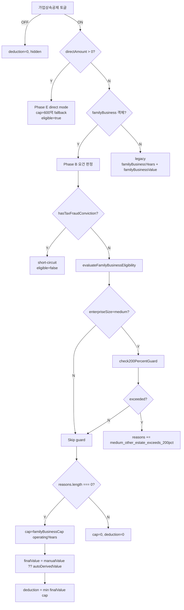

# 가업상속공제 정밀화 — 엔진·UI 통합 디자인 (v2)

> 계획서: [`docs/00-pm/inheritance-family-business-deduction-expansion.plan.md`](../../../00-pm/inheritance-family-business-deduction-expansion.plan.md) v3 통합 동기화 완료
>
> **v1 → v2 변경** (2026-05-21 통합 비교 정정):
> - §1.2 FamilyBusinessInheritanceInput 필드 총수 **21개** 명시 (operatingYears·deathDate 포함)
> - §2 케이스 매트릭스 C7 → C7/C7b 상장·비상장 분리
> - §3.1 evaluateFamilyBusinessEligibility — isListedOnExchange 분기 주석 보강
> - §3.2 computeInheritanceTaxWithoutFBD 간이 산식 명시
> - §3.3 Orchestrator breakdown 본문 채움
> - §4 사후관리·추징 — 자산처분비율 정의 (상증령 §15⑩)
> - §5.3 Mermaid 우선순위 결정 트리 추가
> - §5.4 Zod 스키마 정의 + EstateItem refine (배타성)
> - §5.5 normalize 마이그레이션 코드 추가
> - §7.1 ToggleCard + RadioCardGroup 2-층 위젯 트리 정정
> - §7.2 PropertyValuationForm 분류 위젯 추가
> - §7.3 결과 카드 3분기 (eligible/ineligible/direct) 레이아웃 추가
>
> 대상 법령 (KoreanLaw MCP 2026-05-21 검증):
> - 상증법 §18의2 (mst=276123, 시행 2026-01-02)
> - 상증령 §15 (mst=283637, 시행 2026-02-27)
>
> 정책: `[[korean-law-citation-verify]]` · `[[single-source-engine-helper]]` · `[[feedback_three_state_optional_mode_toggle]]` · `[[mirror-pattern]]` · `[[feedback_ui_engine_dual_truth_avoidance]]` · `[[pre-do-anchor-verification]]`

---

## §1. 도메인 모델

### 1.1 EstateItem 가업 분류 신규 필드

`lib/tax-engine/types/inheritance-gift.types.ts`:

```ts
export type FamilyBusinessCategory =
  | "business_real_estate"   // 가업용 부동산 (사업장·공장·창고·부속토지)
  | "business_equipment"     // 가업용 기계장치·설비
  | "corporate_stock"        // 가업 법인 주식 (사업무관자산 차감 후)
  | "intangible_asset"       // 영업권·특허
  | "inventory"              // 가업 재고자산
  | "other";

export interface EstateItem {
  // ... 기존
  /** 가업상속 자산 분류 — 상증법 §18의2 + 상증령 §15⑤ */
  familyBusinessCategory?: FamilyBusinessCategory;
}
```

### 1.2 FamilyBusinessInheritanceInput (요건 판정 입력)

```ts
export interface FamilyBusinessInheritanceInput {
  businessType: "individual" | "corporate";
  operatingYears: number;
  deathDate?: string;

  enterpriseSize: "sme" | "medium";
  averageRevenue3Y?: number;
  totalAssets?: number;
  isEligibleIndustry: boolean;

  // ─ 피상속인 (상증령 §15③1호) ─
  decedentMajorShareholdingMet?: boolean;     // corporate 전용
  isListedOnExchange?: boolean;               // corporate 전용
  decedentCEORequirementMet: boolean;

  // ─ 상속인 (상증령 §15③2호) ─
  heirIsAdult: boolean;
  heirTwoYearEngagement: boolean;
  decedentEarlyDeath?: boolean;               // §15③2호 나 단서 (2년 면제)
  heirOfficerByFilingDeadline: boolean;
  heirCEOWithinTwoYears: boolean;
  spouseFulfillsRequirements?: boolean;       // §15③2호 후단 간주

  // ─ §18의2② 200% 가드 ─
  heirOtherEstateValue?: number;
  heirDebt?: number;

  // ─ 안내 동의 ─
  unrelatedAssetsAcknowledged: boolean;
  postManagementAcknowledged: boolean;

  // ─ §18의2⑧1호 ─
  hasTaxFraudConviction?: boolean;
}
```

### 1.3 InheritanceDeductionInput 확장

```ts
export interface InheritanceDeductionInput {
  // ... 기존
  estateItems?: EstateItem[];                            // 자동 합산용 (기존 — 명시)
  familyBusinessValue?: number;                          // 사용자 override
  /** @deprecated familyBusiness.operatingYears 사용 */
  familyBusinessYears?: number;
  familyBusinessDirectAmount?: number;                   // Phase E escape hatch
  familyBusiness?: FamilyBusinessInheritanceInput;       // Phase B 신규
}
```

### 1.4 결과 타입

```ts
export type FamilyBusinessIneligibleReason =
  | "operating_years_below_10"
  | "enterprise_size_exceeded"
  | "industry_not_eligible"
  | "decedent_ceo_requirement_failed"
  | "decedent_majority_share_failed"
  | "heir_not_adult"
  | "heir_engagement_short"
  | "heir_officer_not_appointed"
  | "heir_ceo_not_scheduled"
  | "medium_other_estate_exceeds_200pct"
  | "tax_fraud_conviction";

export interface FamilyBusinessDeductionDetail {
  eligible: boolean;
  ineligibleReasons?: FamilyBusinessIneligibleReason[];
  appliedCap: 0 | 30_000_000_000 | 40_000_000_000 | 60_000_000_000;
  operatingYears: number;
  autoDerivedValue?: number;
  manualValue?: number;
  finalValue: number;
  deduction: number;
  usedDirectInput: boolean;
  mediumGuard?: {
    taxIfNoFBD: number;
    cap200pct: number;
    otherEstateNet: number;
    exceeded: boolean;
  };
}

export interface InheritanceDeductionResult {
  // ... 기존
  familyBusinessDeduction: number;
  familyBusinessDetail?: FamilyBusinessDeductionDetail;
}
```

---

## §2. 케이스 매트릭스 (Pre-Do anchor 필수)

| ID | 사업유형 | 영위 | 규모 | 피상속인 요건 | 상속인 요건 | 200% 가드 | 조세포탈 | 기대 결과 |
|----|---------|------|------|-------------|------------|----------|---------|----------|
| **C1** | corporate | 9년 | sme | ✅ | ✅ | N/A | ❌ | 자격 미충족 `operating_years_below_10`, cap=0 |
| **C2** | corporate | 15년 | sme | ✅ | ✅ | N/A | ❌ | 300억 캡 |
| **C3** | corporate | 25년 | sme | ✅ | ✅ | N/A | ❌ | 400억 캡 |
| **C4** | corporate | 35년 | sme | ✅ | ✅ | N/A | ❌ | 600억 캡 |
| **C5** | corporate | 15년 | medium | ✅ | ✅ | 외산>200% | ❌ | 자격 미충족 `medium_other_estate_exceeds_200pct` |
| **C6** | corporate | 15년 | medium | ✅ | ✅ | 외산<200% | ❌ | 300억 캡 + mediumGuard 메타 |
| **C7** | corporate (비상장) | 15년 | sme | 지분 30% (비상장 40% 미달) | ✅ | N/A | ❌ | 자격 미충족 `decedent_majority_share_failed` |
| **C7b** | corporate (상장) | 15년 | sme | 지분 25% (상장 20% 이상 충족) | ✅ | N/A | ❌ | 자격 충족 — 300억 캡 |
| **C8** | corporate | 15년 | sme | ✅ | 17세 | N/A | ❌ | 자격 미충족 `heir_not_adult` |
| **C9** | corporate | 15년 | sme | ✅ | 배우자 충족 간주 | N/A | ❌ | 300억 캡 (heir 4종 skip) |
| **C10** | individual | 15년 | sme | CEO ✅ | ✅ | N/A | ❌ | 300억 캡 (지분 요건 skip) |
| **C11** | corporate | 15년 | sme | ✅ | ✅ | N/A | ✅ | 자격 미충족 `tax_fraud_conviction` (short-circuit) |
| **C12** | corporate | 30년 | medium | ✅ | ✅ | 외산<200% | ❌ | 600억 캡 |
| **C13** | (escape) | — | — | — | — | — | — | `familyBusinessDirectAmount` 직접 입력 — 600억 캡 적용, 요건 우회 |
| **C14** | corporate | 20년 | sme | ✅ | ✅ | N/A | ❌ | EstateItem 합산 자동 도출 — `familyBusinessCategory` 4건 합 |
| **C15** | corporate | 15년 | sme | ✅ | ✅ | N/A | ❌ | `familyBusinessYears` legacy 입력 → `operatingYears` fallback 검증 |

---

## §3. 엔진 구현

### 3.1 핵심 헬퍼 (`lib/tax-engine/deductions/family-business.ts` sibling 분리)

```ts
// [[single-source-engine-helper]] [[feedback_ui_engine_dual_truth_avoidance]]
export function familyBusinessCap(operatingYears: number | undefined): number {
  if (operatingYears == null) return 60_000_000_000;   // legacy/directAmount
  if (operatingYears >= 30) return 60_000_000_000;
  if (operatingYears >= 20) return 40_000_000_000;
  if (operatingYears >= 10) return 30_000_000_000;
  return 0;
}

export function evaluateFamilyBusinessEligibility(
  input: FamilyBusinessInheritanceInput,
): { eligible: boolean; reasons: FamilyBusinessIneligibleReason[] } {
  const reasons: FamilyBusinessIneligibleReason[] = [];

  // short-circuit: 조세포탈 형 확정
  if (input.hasTaxFraudConviction) {
    return { eligible: false, reasons: ["tax_fraud_conviction"] };
  }

  if (input.operatingYears < 10) reasons.push("operating_years_below_10");
  if (!input.isEligibleIndustry) reasons.push("industry_not_eligible");

  // 규모
  if (input.enterpriseSize === "sme") {
    if ((input.totalAssets ?? 0) >= 500_000_000_000) reasons.push("enterprise_size_exceeded");
  } else {
    if ((input.averageRevenue3Y ?? 0) >= 500_000_000_000) reasons.push("enterprise_size_exceeded");
  }

  // 피상속인 (corporate만 지분 요건)
  // decedentMajorShareholdingMet는 UI에서 "40% (상장 20%) × 10년 보유 충족" boolean.
  // 사용자가 isListedOnExchange 토글에 따라 hint("40%" vs "20%")를 보고 직접 판정 — 엔진은 boolean만 평가.
  // 정합성: corporate일 때 isListedOnExchange는 명시 필요 (UI validate).
  if (input.businessType === "corporate") {
    if (!input.decedentMajorShareholdingMet) reasons.push("decedent_majority_share_failed");
  }
  if (!input.decedentCEORequirementMet) reasons.push("decedent_ceo_requirement_failed");

  // 상속인 (배우자 충족 간주 시 skip)
  if (!input.spouseFulfillsRequirements) {
    if (!input.heirIsAdult) reasons.push("heir_not_adult");
    const engagementMet = input.heirTwoYearEngagement || input.decedentEarlyDeath;
    if (!engagementMet) reasons.push("heir_engagement_short");
    if (!input.heirOfficerByFilingDeadline) reasons.push("heir_officer_not_appointed");
    if (!input.heirCEOWithinTwoYears) reasons.push("heir_ceo_not_scheduled");
  }

  return { eligible: reasons.length === 0, reasons };
}

export function deriveFamilyBusinessValue(items: EstateItem[]): number {
  return items
    .filter((i) => i.familyBusinessCategory !== undefined)
    .reduce((sum, i) => sum + (i.marketValue ?? 0), 0);
}

/**
 * 가업상속공제 미적용 가정 시 산출세액 (상증법 §3의2①·② 가업상속인 부담분).
 * orchestrator에서 1차 산정한 본 anchor 값 주입.
 * 본 PR은 간이 산식: `(taxableEstateValue × 누진세율) × (heir_share)` — Phase F+ 정밀화.
 */
export type ComputeTaxIfNoFBDFn = (
  input: InheritanceDeductionInput,
  taxableEstateValue: number,
) => number;

export function check200PercentGuard(
  fb: FamilyBusinessInheritanceInput,
  taxIfNoFBD: number,
): FamilyBusinessDeductionDetail["mediumGuard"] | undefined {
  if (fb.enterpriseSize !== "medium") return undefined;
  const cap200pct = taxIfNoFBD * 2;
  const otherEstateNet = (fb.heirOtherEstateValue ?? 0) - (fb.heirDebt ?? 0);
  return {
    taxIfNoFBD,
    cap200pct,
    otherEstateNet,
    exceeded: otherEstateNet > cap200pct,
  };
}
```

### 3.2 computeInheritanceTaxWithoutFBD (200% 가드 보조 산정)

본 PR 간이 산식 — orchestrator 1차 산정값 주입. Phase F+ 정밀화.

```ts
// inheritance-tax.ts orchestrator에서 가업상속공제 STEP 이전 산정값 사용
// 본 PR 간이 구현: 누진세율 × 가업상속인 부담 비율
function computeInheritanceTaxWithoutFBD(
  input: InheritanceTaxInput,
  taxableEstateValue: number,
): number {
  const fakeRawTotal = sumDeductionsExceptFamilyBusiness(input);
  const taxBase = Math.max(0, taxableEstateValue - fakeRawTotal);
  const totalTax = calculateProgressiveTax(taxBase, INHERITANCE_BRACKETS);
  const heirShare = computeHeirShareRatio(input, "familyBusinessHeir");
  return Math.floor(totalTax * heirShare);
}
```

### 3.3 Orchestrator 통합 (`inheritance-deductions.ts:391`)

```ts
// ⑧ 가업상속공제 (기존 위치 — Phase B 확장)
let bizResult: { deduction: number; breakdown: CalculationStep[]; detail?: FamilyBusinessDeductionDetail };
const fb = input.familyBusiness;

if (input.familyBusinessDirectAmount !== undefined && input.familyBusinessDirectAmount > 0) {
  // Phase E escape hatch — 요건 우회
  const cap = 60_000_000_000 as const;  // 600억 fallback (legacy 단일 캡)
  const capped = Math.min(input.familyBusinessDirectAmount, cap);
  bizResult = {
    deduction: capped,
    breakdown: [{ label: "가업상속공제 (직접 입력)", amount: capped, lawRef: INH.FAMILY_BUSINESS_DEDUCTION }],
    detail: { eligible: true, appliedCap: cap, operatingYears: 0,
              finalValue: capped, deduction: capped, usedDirectInput: true },
  };
} else if (fb) {
  // Phase B 요건 판정 모드
  const { eligible, reasons } = evaluateFamilyBusinessEligibility(fb);
  const taxIfNoFBD = computeInheritanceTaxWithoutFBD(input, taxableEstateValue);
  const guard = check200PercentGuard(fb, taxIfNoFBD);
  const reasonsFinal = guard?.exceeded ? [...reasons, "medium_other_estate_exceeds_200pct"] : reasons;
  const cap = eligible && !guard?.exceeded ? familyBusinessCap(fb.operatingYears) : 0;
  const autoValue = deriveFamilyBusinessValue(input.estateItems ?? []);
  const finalValue = input.familyBusinessValue ?? autoValue;
  const deduction = cap > 0 ? Math.min(finalValue, cap) : 0;
  bizResult = {
    deduction,
    breakdown: [
      { label: "가업상속재산가액 (자동합산)", amount: autoValue },
      ...(input.familyBusinessValue !== undefined
        ? [{ label: "가업상속재산가액 (사용자 override)", amount: input.familyBusinessValue }]
        : []),
      { label: `가업상속공제 한도 (영위 ${fb.operatingYears}년)`, amount: cap, lawRef: INH.FAMILY_BUSINESS_DEDUCTION },
      ...(guard?.exceeded
        ? [{ label: "§18의2② 200% 가드 — 공제 배제", amount: 0, lawRef: INH.FAMILY_BUSINESS_DEDUCTION }]
        : []),
      { label: "가업상속공제 적용액", amount: deduction },
    ],
    detail: {
      eligible: reasonsFinal.length === 0,
      ineligibleReasons: reasonsFinal.length > 0 ? reasonsFinal : undefined,
      appliedCap: cap as 0 | 30_000_000_000 | 40_000_000_000 | 60_000_000_000,
      operatingYears: fb.operatingYears,
      autoDerivedValue: autoValue,
      manualValue: input.familyBusinessValue,
      finalValue,
      deduction,
      usedDirectInput: false,
      mediumGuard: guard,
    },
  };
} else {
  // legacy fallback — familyBusinessYears 단독 사용
  const years = input.familyBusinessYears;
  const value = input.familyBusinessValue ?? 0;
  const cap = familyBusinessCap(years);
  const deduction = Math.min(value, cap);
  bizResult = {
    deduction,
    breakdown: value > 0 ? [
      { label: "가업상속재산가액 (legacy)", amount: value },
      { label: `가업상속공제 (legacy ${years ?? "?"}년)`, amount: deduction, lawRef: INH.FAMILY_BUSINESS_DEDUCTION },
    ] : [],
    detail: value > 0 ? {
      eligible: cap > 0, appliedCap: cap as FamilyBusinessDeductionDetail["appliedCap"],
      operatingYears: years ?? 0, finalValue: value, deduction, usedDirectInput: false,
    } : undefined,
  };
}

const familyBusinessDeduction = bizResult.deduction;
const familyBusinessDetail = bizResult.detail;
```

### 3.3 §24 종합한도와의 관계

- 가업상속공제는 STEP ⑧ — `rawTotal` 합산 후 `applyDeductionLimit`에서 §24 ceiling 적용
- 200% 가드 미충족 시 `familyBusinessDeduction=0` → `rawTotal` 영향 없음
- 직접 입력 모드(Phase E)도 동일 — `rawTotal` 합산 → §24 한도 적용

### 3.4 farmingCategory ↔ familyBusinessCategory 배타성

`lib/calc/inheritance-validate.ts`:
```ts
for (const item of estateItems) {
  if (item.farmingCategory && item.familyBusinessCategory) {
    errors.push({ field: `estateItems.${item.id}`, reason: "asset_dual_category_conflict" });
  }
}
```

### 3.5 businessType ↔ corporate_stock 정합성

```ts
if (fb?.businessType === "individual") {
  const hasCorpStock = estateItems.some((i) => i.familyBusinessCategory === "corporate_stock");
  if (hasCorpStock) errors.push({ field: "businessType", reason: "business_type_mismatch" });
}
```

---

## §4. 사후관리·추징 (Phase F — 별도 PR scope)

본 PR에서는 **산식 동결만**. 추적은 후속 PR.

```ts
// Phase F 산식 (본 PR scope 외)
// 자산처분비율 (assetDisposalRatio): 상증령 §15⑩ 산식
//   = 처분 자산의 상속개시일 현재 가액 / 전체 가업용 자산의 상속개시일 현재 가액
const recapture =
  appliedDeduction * 1.00 * (violationType === "asset_disposal" ? assetDisposalRatio : 1);
// 상증령 §15⑮ = 100분의 100 일률
// §18의2⑤1호 (자산 처분) 위반 시만 자산처분비율 추가 곱

// 이자상당액 (상증령 §15⑯)
const interest =
  determinedTax
  × daysFromFilingDeadlineToViolation
  × (NTBL_INTEREST_RATE / 365);
```

---

## §5. 테스트 anchor

### 5.1 단위 (`__tests__/tax-engine/inheritance-family-business.test.ts`)

| Anchor ID | 케이스 | 기대값 |
|-----------|--------|--------|
| FB-CAP-1 | C1 영위 9년 | `appliedCap=0`, `reasons=["operating_years_below_10"]`, `deduction=0` |
| FB-CAP-2 | C2 영위 15년 + 자산 100억 | `appliedCap=30_000_000_000`, `deduction=10_000_000_000` |
| FB-CAP-3 | C3 영위 25년 + 자산 500억 | `appliedCap=40_000_000_000`, `deduction=40_000_000_000` |
| FB-CAP-4 | C4 영위 35년 + 자산 1000억 | `appliedCap=60_000_000_000`, `deduction=60_000_000_000` |
| FB-GUARD-1 | C5 medium 외산>200% | `eligible=false`, `reasons` 포함, `mediumGuard.exceeded=true` |
| FB-GUARD-2 | C6 medium 외산<200% | `eligible=true`, `mediumGuard.exceeded=false`, 300억 캡 |
| FB-SHARE-1 | C7 corporate 지분 미충족 | `decedent_majority_share_failed` |
| FB-INDIV-1 | C10 individual + CEO | 지분 요건 skip, 300억 캡 |
| FB-SPOUSE-1 | C9 배우자 충족 간주 | heir 4종 skip, 300억 캡 |
| FB-FRAUD-1 | C11 조세포탈 short-circuit | `reasons=["tax_fraud_conviction"]` only |
| FB-DIRECT-1 | C13 직접 입력 100억 | `usedDirectInput=true`, `deduction=10_000_000_000` |
| FB-AUTO-1 | C14 EstateItem 자동 합산 | `autoDerivedValue` = 분류 4건 합 |
| FB-LEGACY-1 | C15 `familyBusinessYears` fallback | legacy 경로 작동 + sessionStorage 마이그레이션 |
| FB-EXCL-1 | dual category 동시 설정 | validate `asset_dual_category_conflict` |
| FB-MISMATCH-1 | individual + corporate_stock | validate `business_type_mismatch` |

### 5.2 시나리오 PDF (`__tests__/tax-engine/inheritance/family-business-pdf.test.ts`)

Do 단계 사용자 PDF 첨부 시 anchor 행 번호 동결 (`[[feedback_pdf_table_row_one_to_one_mapping]]`).

---

## §5.3 우선순위 결정 트리



## §5.4 Zod 스키마 정의 (⑫ 동기화)

`app/api/calc/inheritance/route.ts`:

```ts
const FamilyBusinessCategoryEnum = z.enum([
  "business_real_estate", "business_equipment", "corporate_stock",
  "intangible_asset", "inventory", "other",
]);

const FamilyBusinessInheritanceInputSchema = z.object({
  businessType: z.enum(["individual", "corporate"]),
  operatingYears: z.number().int().nonnegative(),
  deathDate: z.string().optional(),
  enterpriseSize: z.enum(["sme", "medium"]),
  averageRevenue3Y: z.number().nonnegative().optional(),
  totalAssets: z.number().nonnegative().optional(),
  isEligibleIndustry: z.boolean(),
  decedentMajorShareholdingMet: z.boolean().optional(),
  isListedOnExchange: z.boolean().optional(),
  decedentCEORequirementMet: z.boolean(),
  heirIsAdult: z.boolean(),
  heirTwoYearEngagement: z.boolean(),
  decedentEarlyDeath: z.boolean().optional(),
  heirOfficerByFilingDeadline: z.boolean(),
  heirCEOWithinTwoYears: z.boolean(),
  spouseFulfillsRequirements: z.boolean().optional(),
  heirOtherEstateValue: z.number().nonnegative().optional(),
  heirDebt: z.number().nonnegative().optional(),
  unrelatedAssetsAcknowledged: z.boolean(),
  postManagementAcknowledged: z.boolean(),
  hasTaxFraudConviction: z.boolean().optional(),
});

// EstateItem 확장 — farmingCategory와 동시 정의 (배타성 validate는 별도)
const EstateItemSchema = z.object({
  // ... 기존
  farmingCategory: FarmingCategoryEnum.optional(),
  familyBusinessCategory: FamilyBusinessCategoryEnum.optional(),
}).refine(
  (item) => !(item.farmingCategory && item.familyBusinessCategory),
  { message: "asset_dual_category_conflict — 영농·가업 분류 동시 선택 불가" },
);

// InheritanceCalculationRequest 확장
const InheritanceCalculationRequestSchema = z.object({
  // ... 기존
  familyBusiness: FamilyBusinessInheritanceInputSchema.optional(),
  familyBusinessYears: z.number().optional(),       // legacy
  familyBusinessDirectAmount: z.number().optional(),
  familyBusinessValue: z.number().optional(),
});
```

## §5.5 normalize 마이그레이션 (③ 동기화)

`lib/calc/inheritance-form.ts`:

```ts
export function normalizeInheritanceForm(form: InheritanceFormState): InheritanceFormState {
  // legacy familyBusinessYears → familyBusiness.operatingYears 1회 마이그레이션
  if (form.familyBusiness === undefined && form.familyBusinessYears) {
    return {
      ...form,
      familyBusiness: {
        ...DEFAULT_FAMILY_BUSINESS_FORM,
        operatingYears: parseInt(form.familyBusinessYears, 10) || 0,
      },
      familyBusinessYears: undefined,  // 마이그레이션 후 제거
    };
  }
  return form;
}
```

`lib/storage/calc-wizard-migration.ts`:
- 버전 N → N+1 마이그레이션 step 추가
- IndexedDB 저장 케이스 `familyBusinessYears` 잔존 시 동일 변환

---

## §6. 14개 동기화 지점 매트릭스

| # | 지점 | 파일 | 변경 |
|---|------|------|------|
| ① | 폼 상태 | `inheritance/shared.ts` | `familyBusiness: FamilyBusinessFormState \| undefined` |
| ② | initial | `inheritance/shared.ts` | `INITIAL_FORM.familyBusiness = undefined` |
| ③ | normalize | `lib/calc/inheritance-form.ts` | legacy `familyBusinessYears` → `familyBusiness.operatingYears` 마이그레이션 |
| ④ | API 변환 | `lib/calc/inheritance-api.ts` | spread + `familyBusiness` 객체 + legacy 병행 |
| ⑤ | UI 위젯 | `inheritance/step4-5.tsx` | §7 위젯 트리 |
| ⑥ | 사이드바 | `lib/stores/calc-wizard-inheritance.ts` | `familyBusinessDeduction` 0 미표시 |
| ⑦ | 결과 카드 | `results/InheritanceTaxResultView.tsx` | `FamilyBusinessDetailCard` 신규 |
| ⑧ | validation | `lib/calc/inheritance-validate.ts` | 18필드 누락 차단 + 직접입력 우회 + 3중 패턴 |
| ⑨ | Zod enum (메인) | `app/api/calc/inheritance/route.ts` | `familyBusinessCategory` enum 6종 |
| ⑩ | Zod enum (companion) | 동일 | `businessType`·`enterpriseSize`·`FamilyBusinessIneligibleReason` |
| ⑪ | acquisitionDate fallback | N/A (상속세) | — |
| ⑫ | Zod 입력 객체 | `app/api/calc/inheritance/route.ts` | `FamilyBusinessInheritanceInputSchema` |
| ⑬ | callInheritanceAPI body | `lib/calc/inheritance-api.ts` | `body.familyBusiness` + legacy 병행 |
| ⑭ | route handler 매핑 | `app/api/calc/inheritance/route.ts` | `coerceDates(input.familyBusiness, ["deathDate"])` |

---

## §7. UI 위젯 트리 (`step4-5.tsx`, Step 4 가업상속공제 섹션)

### 7.1 ToggleCard (외부 ON/OFF) + RadioCardGroup (내부 모드) 2-층

```
[가업상속공제 ToggleCard — 전체 ON/OFF]
│  OFF 시: familyBusiness = undefined, familyBusinessDirectAmount = undefined → 카드 hidden
│  ON 시: 아래 모드 선택 표시
└── [모드 RadioCardGroup — 요건판정 / 직접입력]
    │
    ├── [요건판정 모드 — familyBusiness = {...}]
    │   ├── [LawArticleModal 링크] §18의2 / 상증령 §15
    │   ├── [사업 유형 RadioCardGroup] individual | corporate
    │   ├── [영위 연수 DecimalInput + 한도 미리보기 카드]
    │   │      "영위 15년 → 한도 300억원 (§18의2① 1호)"
    │   ├── [기업 규모 RadioCardGroup] sme | medium
    │   │      [규모 수치 CurrencyInput] (sme: totalAssets / medium: averageRevenue3Y)
    │   ├── [별표 업종 ToggleCard sky] isEligibleIndustry
    │   ├── [피상속인 요건 섹션 카드]
    │   │      ├── (corporate 한정) [거래소 상장 ToggleCard] isListedOnExchange
    │   │      ├── (corporate 한정) [지분 요건 ToggleCard] decedentMajorShareholdingMet
    │   │      │      hint: "40% (상장 20%) × 10년 보유"
    │   │      └── [CEO 요건 ToggleCard] decedentCEORequirementMet
    │   ├── [상속인 요건 섹션 카드]
    │   │      ├── [배우자 충족 간주 ToggleCard amber] spouseFulfillsRequirements
    │   │      │      ON 시 아래 4종 grayed
    │   │      ├── [18세 이상 ToggleCard] heirIsAdult
    │   │      ├── [2년 종사 ToggleCard + 조기사망 면제 부토글] heirTwoYearEngagement·decedentEarlyDeath
    │   │      ├── [신고기한 내 임원 취임 ToggleCard] heirOfficerByFilingDeadline
    │   │      └── [2년 내 대표이사 ToggleCard] heirCEOWithinTwoYears
    │   ├── [200% 가드 카드 — medium 한정]
    │   │      ├── [heirOtherEstateValue CurrencyInput]
    │   │      └── [heirDebt CurrencyInput]
    │   │      미리보기: "외산 net = 50억 / 200% cap = 60억 → 통과"
    │   ├── [안내 카드 sky] 사업무관자산 — unrelatedAssetsAcknowledged 체크 강제
    │   ├── [안내 카드 amber] 사후관리 5년 의무 — postManagementAcknowledged 체크 강제
    │   └── [조세포탈 ToggleCard rose] hasTaxFraudConviction (경고 배지)
    │
    └── [직접입력 모드 — familyBusinessDirectAmount > 0]
        ├── [familyBusinessDirectAmount CurrencyInput] (배경 violet/50 차별화)
        └── [hint amber] "요건 판정 우회 — 한도 600억 fallback. 정확한 공제액은 요건판정 모드 권장."
```

### 7.2 PropertyValuationForm / StockValuationForm 위젯

```
[EstateItem 카드 (기존)]
├── ... 기존 평가 입력
└── [FamilyBusinessCategorySection — 신규]
    ├── [select] familyBusinessCategory (6종 + "해당없음")
    └── [경고 배지 rose] farmingCategory 동시 설정 시 "중복 분류 — 한쪽만 선택"
```

### 7.3 결과 카드 `FamilyBusinessDetailCard` 레이아웃

**자격 충족 분기**:
```
┌─ 가업상속공제 (eligible=true) ───────────────────┐
│ 공제액: 20,000,000,000 (200억)                  │
│ ─────────────────────────────                   │
│ • 영위 연수: 15년 → 한도 300억 (§18의2① 1호)     │
│ • 자동 합산: 200억 (EstateItem 분류 4건)         │
│ • 사용자 override: -                             │
│ • 최종 가액: 200억 → 300억 캡 미달 → 200억 공제   │
│ ─────────────────────────────                   │
│ [200% 가드 메타 — medium 한정] (mediumGuard 존재) │
│ ┌─────────────────────────────────┐             │
│ │ 미공제 산출세액 (taxIfNoFBD)  30억 │             │
│ │ 200% cap                    60억 │             │
│ │ 외산 net                    50억 │             │
│ │ 결과                       통과 ✅ │             │
│ └─────────────────────────────────┘             │
└─────────────────────────────────────────────────┘
```

**자격 미충족 분기** (rose tone 배경):
```
┌─ 가업상속공제 (eligible=false) ──────────────────┐
│ 공제액: 0원 — 자격 미충족                         │
│ ─────────────────────────────                   │
│ 미충족 사유 (FamilyBusinessIneligibleReasonLabels)│
│ • 영위 10년 미만 (§18의2① 가업 정의 미충족)        │
│ • 별표 업종 외 사업 (상증령 §15①1·②1)             │
│ • 중견기업 — 가업외 상속재산이 200% 초과 (§18의2②)│
│ ─────────────────────────────                   │
│ [LawArticleModal 링크] §18의2 / 상증령 §15        │
└─────────────────────────────────────────────────┘
```

**직접 입력 분기** (violet/50 배경):
```
┌─ 가업상속공제 (직접 입력 모드) ───────────────────┐
│ 공제액: 15,000,000,000 (150억, 600억 한도 내)    │
│ ─────────────────────────────                   │
│ ⚠ 요건 판정 우회 모드 — 정확성은 사용자 책임       │
│ ⚠ 사후관리 위반 시 추징 (별도 PR Phase F)         │
└─────────────────────────────────────────────────┘
```

### 7.4 사이드바 합계 (`[[tax-summary-sidebar-pattern]]`)

`familyBusinessDeduction` 0원 시 미표시. 자격 미충족 시 0이므로 자동 hidden.

---

## §8. 사용자 시나리오

### 시나리오 1 — 중소기업 15년 영위 (정상 가업상속)
1. 마법사 Step 4 가업상속공제 토글 ON → 요건판정 모드
2. corporate / 15년 / sme / 별표 ✅ / 피상속인·상속인 요건 ✅
3. EstateItem에서 `business_real_estate` 2건 + `corporate_stock` 1건 합 200억
4. 결과: `deduction=20_000_000_000` (300억 캡 미달), `mediumGuard=undefined`

### 시나리오 2 — 중견기업 + 200% 가드 발동
1. medium / 15년 / 매출 4천억 / 외 상속재산 50억 / 채무 5억 → 외산 45억
2. `taxIfNoFBD` = 30억 → `cap200pct` = 60억 → 외산 45억 < 60억 → OK
3. 외 상속재산 80억으로 변경 → 외산 75억 > 60억 → 자격 미충족
4. 결과: `eligible=false`, `mediumGuard.exceeded=true`, `deduction=0`

### 시나리오 3 — 직접 입력 모드 (Phase E escape)
1. 토글 → 직접입력 모드 선택
2. `familyBusinessDirectAmount=15_000_000_000` 입력
3. 결과: `deduction=15_000_000_000`, `usedDirectInput=true`, 요건 판정 카드 hidden
